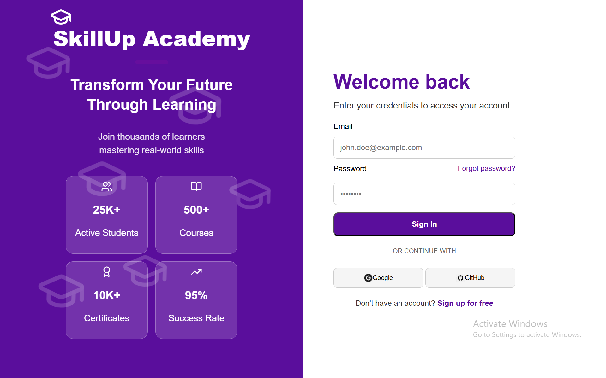
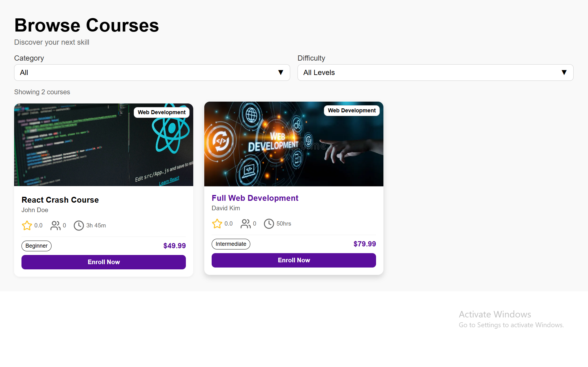
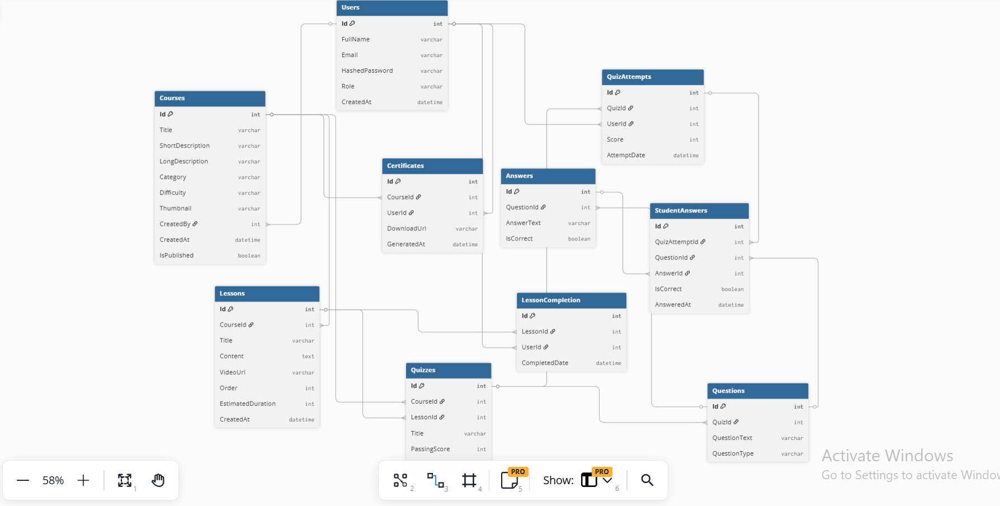

## Learning Management System (LMS)

This project is a Learning Management System (LMS) built with ASP.NET Core Web API, Entity Framework Core, and SQL Server.
It supports user management, courses, lessons, quizzes, certificates, and lesson completion tracking, providing a complete backend for an LMS application.

## Technologies Used

### Backend
* ASP.NET Core Web API
* Entity Framework Core
* SQL Server
* Swagger (OpenAPI)
* C#

### Frontend
* React
* Plain CSS
* REST API Integration (JWT-secured)

* Future enhancement: OAuth2 login via Google & GitHub

## Project Structure

```
LMS.Api/
├── Controllers/      → API Controllers (UsersController)
├── Models/           → Entity Models (User)
├── Data/             → DbContext
├── Migrations/       → EF Core migrations
├── Program.cs        → Application entry point
└── appsettings.json  → Configuration & connection string

Frontend/ (NEW)
├── src/
│   ├── pages/
│   │   ├── Login.jsx
│   │   ├── Signup.jsx
│   │   ├── ForgotPassword.jsx
│   │   └── CoursesList.jsx
│   ├── ui/
│   └── icons/          → Plain CSS files
└── package.json
```
## API Endpoints

### Auth

| Method | Endpoint                   |
| ------ | -------------------------- |
| POST   | /api/auth/register         |
| POST   | /api/auth/login            |
| POST   | /api/auth/forgot-password  |
| POST   | /api/auth/reset-password   |


### Certificates

| Method | Endpoint                         |
| ------ | -------------------------------- |
| GET    | /users/{userId}/certificates     |
| POST   | /courses/{courseId}/certificates |

### Courses

| Method | Endpoint          |
| ------ | ----------------- |
| GET    | /api/Courses      |
| POST   | /api/Courses      |
| GET    | /api/Courses/{id} |
| PUT    | /api/Courses/{id} |
| DELETE | /api/Courses/{id} |

### Lesson Completions

| Method | Endpoint                          |
| ------ | --------------------------------- |
| POST   | /lessons/{lessonId}/complete      |
| GET    | /users/{userId}/lesson-completion |

### Questions

| Method | Endpoint                        |
| ------ | ------------------------------- |
| GET    | /quizzes/{quizId}/questions     |
| POST   | /quizzes/{quizId}/questions     |
| GET    | /api/Questions/{id}             |
| PUT    | /api/Questions/{id}             |
| DELETE | /api/Questions/{id}             |
| GET    | /questions/{questionId}/answers |
| POST   | /questions/{questionId}/answers |

### Quiz Attempts

| Method | Endpoint                            |
| ------ | ----------------------------------- |
| POST   | /quizzes/{quizId}/attempts          |
| GET    | /quizzes/{quizId}/attempts/{userId} |
| POST   | /quiz-attempts/{attemptId}/answers  |
| GET    | /quiz-attempts/{attemptId}/answers  |

### Quizzes

| Method | Endpoint                    |
| ------ | --------------------------- |
| GET    | /courses/{courseId}/quizzes |
| GET    | /lessons/{lessonId}/quizzes |
| POST   | /api/Quizzes                |
| GET    | /api/Quizzes/{id}           |
| PUT    | /api/Quizzes/{id}           |
| DELETE | /api/Quizzes/{id}           |

### Users

| Method | Endpoint        |
| ------ | --------------- |
| GET    | /api/Users      |
| POST   | /api/Users      |
| GET    | /api/Users/{id} |
| PUT    | /api/Users/{id} |
| DELETE | /api/Users/{id} |

## Schemas

* Answer
* Certificate
* Course
* Lesson
* LessonCompletion
* Question
* Quiz
* QuizAttempt
* StudentAnswer
* User

---

## API Review

Here’s a preview of the Users API in Swagger UI:


## API Testing

The API is tested using **Swagger UI**.
After running the project, open:

```
https://localhost:{port}/swagger
```

Swagger allows you to:

* Create users
* View users
* Update users
* Delete users

Absolutely! Here’s a cleaner, more professional version of your update for the README. I’ve organized it, removed emoji clutter, and made it concise while keeping all the details:

---

## Frontend Module 

A **React frontend** has been added and fully integrated with the backend authentication system.

### Authentication Pages

**Implemented Pages:**

* Login
* Signup
* Forgot Password (email reset support)

**Features:**

* Integrated with JWT authentication API
* Supports three user roles: **Admin**, **Instructor**, **Student**
* Successful login stores user token and role
* Role-based UI behavior

**Screenshots:**

* **Login Page:**
 
* **Auth API in Swagger:**
 

**Future Improvements:**

* OAuth2 login via Google and GitHub
* Social login button support in UI

---

### Courses Page List (NEW)

**Features:**

* Displays available courses
* Users can enroll directly
* Fully connected to backend Courses API

**Screenshot:**

* **CoursePage:**

* **CoursePage filtered**
 


## Database

* Database is created using **Entity Framework Core Migrations**
* SQL Server is used as the database engine
* Migrations are stored in the `Migrations` folder

## How to Run the Project

1. Open the solution in **Visual Studio**
2. Update the connection string in `appsettings.json` if needed
3. Run the following commands in **Package Manager Console**:

```
Add-Migration InitialUsers
Update-Database
```

4. Run the project
5. Open Swagger and test the API


## Authentication & Authorization

This LMS backend implements **secure authentication and role-based authorization** using **ASP.NET Core Identity** and **JWT (JSON Web Tokens)**.

### Authentication Features

* User registration with email & password
* Secure login with JWT token generation
* Password hashing handled by ASP.NET Identity
* Token-based authentication using `Authorization: Bearer <token>`
* Token validation (issuer, audience, expiration, signing key)

### Authorization & Roles

* Role-based access control using Identity Roles
* Supported roles:

  * **Admin**
  * **Instructor**
  * **Student**
* Protected endpoints using `[Authorize]`
* Role-restricted endpoints using `[Authorize(Roles = "Admin")]`

Example:

* `GET /api/Users` → **Admin only**
* Student users receive **403 Forbidden** if accessing admin endpoints

### JWT Configuration

JWT authentication is configured in `Program.cs` using `JwtBearerAuthentication`.

Token contains:

* User ID
* Email
* Role claim
* Expiration time
* Issuer & Audience validation

### Swagger Authentication Support

Swagger UI is configured to support JWT authentication.

Steps to authenticate in Swagger:

1. Call **POST `/api/Auth/login`**
2. Copy the returned JWT token
3. Click **Authorize** (🔒) in Swagger
4. Enter:

   ```
   Bearer <your-token>
   ```
5. Access protected endpoints directly from Swagger

### Auth Endpoints

| Method | Endpoint             | Description                        |
| ------ | -------------------- | ---------------------------------- |
| POST   | `/api/Auth/register` | Register a new user                |
| POST   | `/api/Auth/login`    | Authenticate and receive JWT token |

---

### Example Authorization Flow

1. Register user
2. Login → receive JWT
3. Use JWT in Authorization header
4. Access protected endpoints
5. Role-based permissions enforced automatically

## Database

The SQL Server database schema is included in the [`Database/LMS_DB_Schema.sql`](Database/LMS_DB_SCHEMA.sql) file.  

It contains the following tables:

* Users  
* Courses  
* Lessons  
* Quizzes  
* Questions  
* Answers  
* QuizAttempts  
* LessonCompletion  
* Certificates  
* StudentAnswers  

All **primary keys**, **foreign keys**, and **relationships** are defined in the script.  

### Entity-Relationship Diagram

Here’s a visual representation of the database structure:




